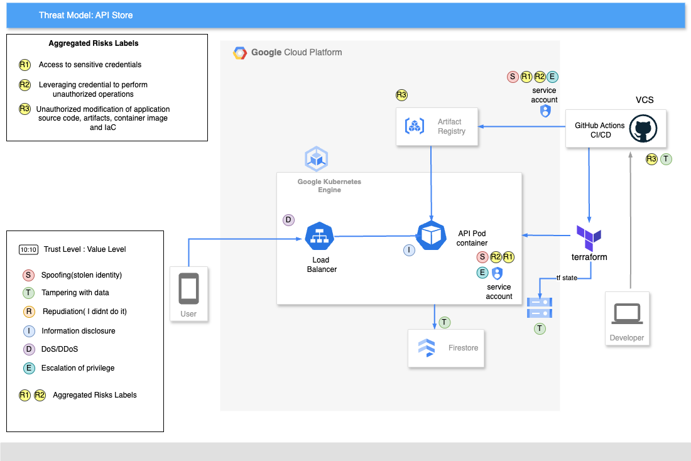

# Threat Model

This document provides a basic threat model for the API Store application.
A threat model is a structured approach used to identify, assess, and mitigate potential security threats to a system or application. The goal is to understand and address the security risks that could negatively impact the confidentiality, integrity, and availability of the system.

We will be using the STRIDE methodology for our thread model which focuses on: 
Spoofing, 
Tampering, 
Repudiation, 
Information Disclosure, 
Denial of Service, and 
Elevation of Privilege.

## Assets to be protected
- Cloud Firestore 
- IaC and Application Source Code
- CI/CD - Github Actions
- Artifact Store
- GKE cluster and Nodes
- Service Accounts

## Trust Levels
 - David(codeowner)

Risks:

| Risk ID | Description | Resolution | Priority |
| --- | --- | --- | --- |
| R1 | Access to sensitive credentials| Credentials securely stored in Secret Management services | Low |
| R2 | Leveraging credential to perform unauthorized operations.  | Least privilege policies granted only to perform required actions. | Low |
| R3 | Unauthorized modification of application source code, artifacts, container image and IaC. | Restrictions on private repository and deployment done by only authorized service accounts. | Low |
